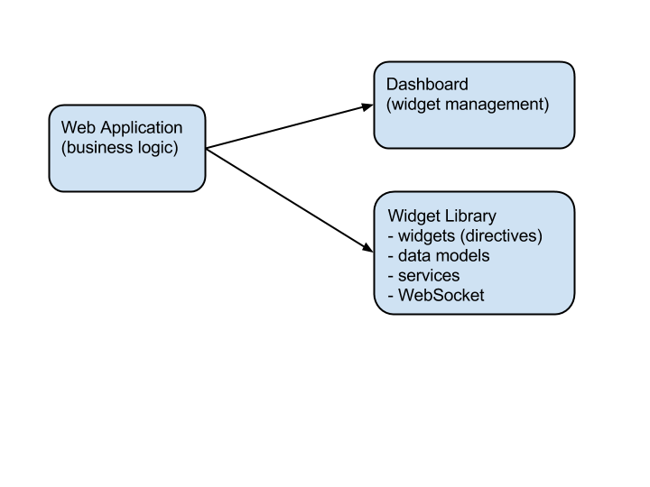

malhar-dashboard-webapp
=================

[](https://travis-ci.org/DataTorrent/malhar-dashboard-webapp)

Dashboard Web Application

[Online Demo](http://datatorrent.github.io/malhar-dashboard-webapp/#/)


## Dependencies

[Dashboard Directive](https://github.com/DataTorrent/malhar-angular-dashboard)

[Widget Library](https://github.com/DataTorrent/malhar-angular-widgets)



## Running Application (minimum dependencies)

1. Node.js way

 Install express

 ``` bash
    $ npm install express
 ```
 Run Node.js server

 ``` bash
    $ node app.js
 ```
 Application will be available at http://localhost:3000.

2. Simple web server way

 Start any web server in "dist" directory, e.g. with Python
 ``` bash
    $ python -m SimpleHTTPServer 8080
 ```
 Application will be available at http://localhost:8080

In both cases static files (including bundled JS/CSS) will be served from "dist" directory.

## Running Application (development mode)
 Install dependencies:

 ``` bash
    $ npm install
 ```

 Install Bower dependencies:

 ``` bash
    $ bower install
 ```

 Run Grunt server task:

 ``` bash
    $ grunt server
 ```

 Application will be available at http://localhost:9000

## Building Application

 Application is built with Grunt.

 ``` bash
    $ npm install -g grunt-cli
    $ grunt
 ```

## Contributing

This project welcomes new contributors.

You acknowledge that your submissions to DataTorrent on this repository are made pursuant the terms of the Apache License, Version 2.0 (http://www.apache.org/licenses/LICENSE-2.0.html) and constitute "Contributions," as defined therein, and you represent and warrant that you have the right and authority to do so.

When **adding new javascript files**, please prepend the Apache v2.0 license header, which can be found in [CONTRIBUTING.md file](https://github.com/DataTorrent/malhar-dashboard-webapp/blob/master/CONTRIBUTING.md).


## Links

[malhar-angular-dashboard](https://github.com/DataTorrent/malhar-angular-dashboard) AngularJS Dashboard directive.

[malhar-angular-widgets](https://github.com/DataTorrent/malhar-angular-widgets) Widget library.

[Node.js](http://nodejs.org/) Software platform built on JavaScript runtime

[AngularJS](http://angularjs.org/) JavaScript framework

[ui-sortable](https://github.com/angular-ui/ui-sortable) AngularJS UI Sortable

[jQuery UI Sortable](http://jqueryui.com/sortable/) jQuery UI Sortable plugin (reordering with drag and drop)

[Bower](http://bower.io/) Package manager for the web

[Grunt](http://gruntjs.com/) JavaScript Task Runner

[Yeoman](http://yeoman.io/) Webapp generator

[DDP](https://github.com/meteor/meteor/blob/master/packages/livedata/DDP.md) Meteor Distributed Data Protocol

[Meteor-DDP](https://github.com/eddflrs/meteor-ddp) Meteor DDP Javascript client